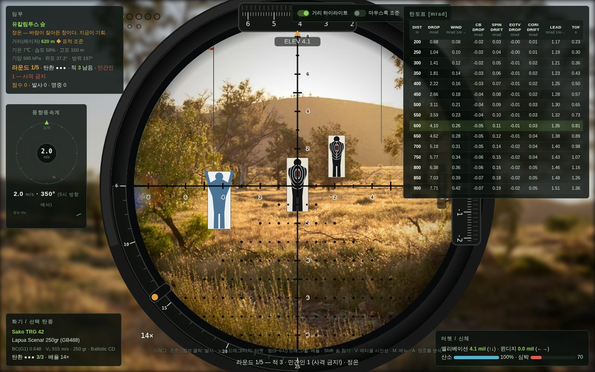

# LMSNIPER — 원거리 저격 탄도 시뮬레이터

외부탄도학(exterior ballistics) 기반의 브라우저 저격 시뮬레이터.
빌드 과정 없이 `index.html`을 열거나 정적 서버로 서빙하면 바로 실행된다.

**▶ 플레이: https://sukh0l.github.io/Lmsniper/**



```bash
# 로컬 실행
python3 -m http.server 8000
# → http://localhost:8000
```

## 물리 모델

3자유도 점질량(point-mass) 모델을 개선 오일러법(Heun)으로 수치적분한다.

| 요소 | 구현 |
|---|---|
| 공기저항 | 표준 저항 G-함수(G1/G7) Mach-Cd 테이블 + 탄도계수(BC) |
| 공기밀도 | 기온·습도(Magnus 포화수증기압)·기압 합성, 고도는 기압고도식 |
| 바람 | 풍속·풍향 벡터 + 돌풍(시간 노이즈), 발사 순간의 실제 바람으로 적분 |
| 중력 낙차 | 적분 내 중력항, 100 m 영점 기준 터렛 보정 |
| 코리올리 효과 | a = −2Ω×v 완전항 (위도·사격방위 반영, 에트뵈시 효과 포함) |
| 스핀 편류 | Litz 근사식 1.25(Sg+1.2)t^1.83 |
| 지구 곡률 | 초장거리 임무에서 접평면 대비 표적 강하 D²/2R 보정 |
| 경사 사격 | 발사각·표적고도를 3D로 직접 적분 (산악 임무) |
| 사수 요인 | 호흡 주기·심박 펄스·미세 떨림, 숨참기 토글(산소/회복 페널티·조준 감도 저하), 반동 |
| 탄약 편차 | 총구속도 표준편차(σMV), 총기 고유 산포(~0.5 MOA) |

### 명중률 분석 (게임 중 `A` 키)

KSME 2017 논문의 두 가지 명중률 예측 방법을 구현해 비교한다:

- **실험적 방법** — 오차 요인(총구속도·조준각·바람)을 몬테카를로로 삽입해
  탄착군 400발을 생성, REP/DEP/CEP와 사각 표적 명중률을 산출
- **해석적 방법** — 유한차분 편미분 감도를 σ² = Σ(∂·σ)² 로 합성(논문 식 1),
  정규분포 가정 명중률 산출

## 게임 규칙

- **선택 흐름**: 임무(맵) → 총기(+레티클) → 탄종 → 플레이.
- **라운드제**: 임무당 3~5라운드, 라운드당 탄환 기본 3발. 제한 시간은 없고
  **탄환 수가 유일한 제약**이다. 탄이 떨어지면 그 라운드 실패, 적을 전원
  제압하면 성공. 라운드당 탄환 수는 맵/총기 데이터에서 조정하는 제작
  설정값으로, 플레이어가 바꿀 수 없다.
- **라운드 표시**: 좌상단 점 — 테두리만=미진행, 검은색 채움=성공,
  회색 채움=실패. 아래 줄에 그 라운드의 발사 결과(명중/빗나감/민간인)를 표시.
- **스폰 앵커**: 각 맵 사진을 분석해 표적이 "땅에 서 있는 것으로 보이는"
  지점(발 위치 + 그 지점까지의 거리)을 지정했다 (`data.js`의 `anchors`).
  표적은 이 앵커에서만 스폰되고, 크기는 앵커 거리에 정비례해 주변
  사물과 원근이 맞는다. 배경 사진은 카메라에 1:1로 고정되어, 시야
  가장자리에서 더 드래그해도 표적·깃발이 밀리지 않는다.
- **매판 랜덤**: 기온·습도·풍속·풍향·사격방위·표적 수/배치가 맵의 기후
  특성 범위 안에서 매 판 랜덤 추출된다.
- **상황 랜덤**: 인질전(적 옆 밀착 인질 — 피격 즉시 실패), 국지풍(표적
  지역 바람이 풍속계와 다름 — 깃발로 판독), 정온, 돌풍 전선.
- **표적지**: 사격장 스타일 인간형 표적지 — 적은 검은 실루엣 + 흉부 링
  (7/8/9/10/X) + 헤드샷 존, 민간인은 손 든 파란 실루엣(NO-SHOOT).
- **피격 존**: 머리(10+2) / 흉부(9) / 복부(7) / 하지(5) / 팔(4). 첫 발 명중 +5.
- **민간인·인질 피격 = 해당 라운드 즉시 실패.** 임무 종료 시 라운드 성공
  비율·정확도·헤드샷으로 S/A/B/C 등급.
- **레이저 측거**: 레티클을 표적에 올리면 그 표적의 실거리가 표시되고,
  탄도표의 강조 행도 조준 중 표적 거리로 갱신된다.
- **거리 하이라이트 토글**: 탄도표의 현재 사거리 강조를 껐다 켤 수 있다
  (거리 가늠도 훈련의 일부).
- **화면**: 1440×900 논리 해상도. 데스크톱은 레터박스 스케일, 모바일
  세로는 정사각 크롭(조준경 비율 유지, 좌우만 잘림).

## 레티클

총기 선택 화면에서 7종 중 고른다 — **Mil-Dot**(기본) · Ballistic CD ·
Sniper P4 · MOA · DMR8i · PSO-1 · FFP Mil-Hash. 전부 FFP라 배율과 무관하게
눈금이 실제 각도와 일치하고, 선택한 레티클의 단위(mrad/MOA)에 맞춰 **측거표가
함께 바뀐다**.

### 시인성 스타일 (`V` 키 / 설정)

검정 단색 레티클은 헛간 그늘·숲처럼 어두운 배경에서 그대로 묻힌다. 대비
장치를 6종 중에서 고를 수 있다 — **굵게**(기본) · 흰 테두리 · 흰 글로우 ·
적색 조명 · 중앙 조명 · 녹색 조명.

선 두께는 `stageScale`로 역보정해 기기와 무관하게 같은 CSS 픽셀로 렌더된다
(보정 전에는 같은 1 px이 모바일 0.43 / 데스크톱 1.20 CSS px으로 3배 가까이
벌어졌다). 눈금 숫자도 같은 방식으로 보정하고 밝은 외곽선을 둘러, 배경이
무엇이든 판독된다. 완성된 레티클 레이어는 캐시해 프레임당 blit 1회로 그린다.

## 모바일 앱 셸 (LRS 스타일)

모바일 세로 화면은 실제 장거리 사격 훈련 앱(LRS)의 UX를 참조해
재구성했다:

- **상단 정보바** — 라운드·잔탄·적/민간인 수·점수·상황, 나가기 버튼.
- **스코프(정사각)** — 드래그 조준, 노브·배율 링 직접 조작.
- **하단 컨트롤 패널** — 탭 3개:
  - *조작*: 라운드·잔탄·현재 고각/윈디지/배율 조회줄, 숨참기 원형
    버튼(홀드), 심박·산소 게이지, **방아쇠 슬라이더**(아래로 당겨 빨간 선을
    넘기면 격발, 진동 피드백), 사수 위치 풍향계 미니 로즈 + CUR/AVG/MAX.
  - *탄도*: 거리별 DROP·WIND·CB DROP·SPIN·EOTV·CORI·LEAD·TOF 표.
  - *측거표*: 거리별 BODY / FULL BODY / CIRCLE / SQUARE 크기 표 —
    레티클 측거 훈련용.
- **하단 내비게이션** — 시뮬레이터 / 클래스룸 / 설정 3탭.
- 모바일 가로는 숨참기 토글(좌)·발사(우) 플로팅 버튼 유지.

## 클래스룸 (전부 무료)

캔버스 다이어그램과 함께 보는 레슨 8종 — 잠금 없음:
튜토리얼(기본 조작) · 탄도 낙차 · 바람 판독 · 공기 밀도 ·
밀 측거 · 코리올리와 스핀 편류 · 명중률 분석(CEP/REP/DEP) ·
교전 수칙(표적 식별).

## 조작

| 입력 | 기능 |
|---|---|
| 드래그 / 짧은 클릭 | 조준 / 발사 (기본) — 설정에서 마우스룩 전환 |
| 상단 노브 드래그·탭 | 엘리베이션 (우→증가 / 좌→감소, 0.1 mil/클릭) |
| 우측 노브 드래그·탭 | 윈디지 (위→증가 / 아래→감소, 0.1 mil/클릭) |
| 스코프 링 9시~6시 드래그 | 배율 (5–25×), 마우스 휠도 가능 |
| Shift | 숨참기 토글 (켜기/끄기 — 꾹 누르고 있을 필요 없음) |
| V | 레티클 시인성 순환 |
| A | 명중률 분석 |
| M | 메뉴로 |
| **모바일** 좌측 숨참기 | 토글형(기본): 탭 = 켜기/끄기 · 홀드형(설정 '숨참기 토글형' 끔): 꾹 누르는 동안만 유지. 둘 다 버튼 위 드래그로 조준(한 손 조작), 산소 소진 시 자동 해제, 숨참기 중 조준 감도 저하. 버튼 위에 심박·산소 바 표시 |
| **모바일** 우측 발사 | 탭 = 발사 (숨참기를 켜 둔 채 그대로 발사 가능) |

라운드가 끝나면 표적이 새로 배치되고 탄환이 재지급된다 (별도 재장전 없음).

## 설정

거리 하이라이트 · 마우스룩 조준(데스크톱) · 사운드 · 레티클 시인성을
켜고 끌 수 있으며, 선택한 값과 레티클 종류는 `localStorage`에 저장되어
새로고침해도 유지된다.

## 에셋

- `assets/bg-<환경>.jpg` — 실사 배경 (farm / forest / plains /
  mountain / desert / tundra / kasbah). 파일이 있으면 자동으로 실사 배경을
  사용하고, 없으면 절차적 장면으로 대체된다. 각도 매핑은 `js/game.js`의
  `BG_META`(mradW·cFrac·xFrac)로 조정.
- 사운드는 전부 WebAudio 합성(임시): 총성·터렛 클릭·볼트/노리쇠·
  공이치기·풍속 연동 바람 앰비언스. 실제 녹음 파일로 교체 예정.

## 총기 / 탄약

총기 5종(Remington 700, Sako TRG 42, AI AXSR, Barrett M107A1, CheyTac M200)과
탄약 7종을 선택할 수 있다. 카드의 설명은 **제조사 공식 페이지**의 소개문을
옮긴 것이며, 공식 자료가 없는 항목(M33 Ball)만 위키피디아를 참조했다 —
각 카드에 출처 링크가 표시된다. BC·총구속도는 제조사 공표값 기준.

## 참고 문헌

- G. Klimi, *Elements of Exterior Ballistics* — G-함수, 표준대기,
  개선 오일러법, 코리올리/스핀 편류/바람 편류
- C. Cranz & K. Becker, *Handbook of Ballistics Vol. 1 — Exterior Ballistics*
- 김건인·강환일·김현수, "탄도방정식을 이용한 화력 성능 분석에 관한 연구",
  대한기계학회 IT융합부문 춘계학술대회 (KSME 17IT-Fr01A02), 2017 —
  실험적/해석적 명중률 예측 방법

## 파일 구성

```
index.html        진입점 + UI 마크업 (앱 셸: 내비/클래스룸/설정 포함)
css/style.css     HUD/메뉴/모바일 패널 스타일
js/ballistics.js  탄도 엔진 (드래그/대기/적분/영점/명중률 분석)
js/data.js        총기·탄약·임무 데이터 (출처 링크 포함)
js/lessons.js     클래스룸 레슨 본문 + 캔버스 다이어그램
js/game.js        렌더링·입력·게임 루프·레티클·앱 셸
docs/             README용 스크린샷
```

## 라이선스 / 재사용 주의

개인 학습용 프로젝트다. `assets/`의 배경 사진은 출처와 재배포 조건이
저장소에 기록되어 있지 않으므로, 그대로 재사용하기 전에 각 이미지의
라이선스를 확인할 것.
